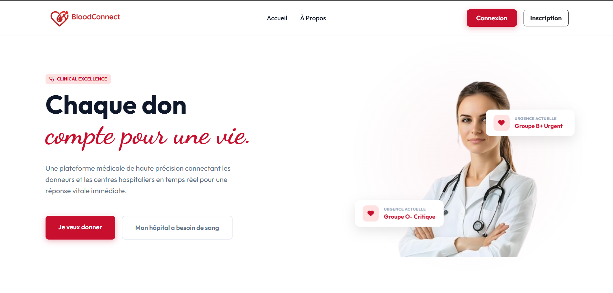
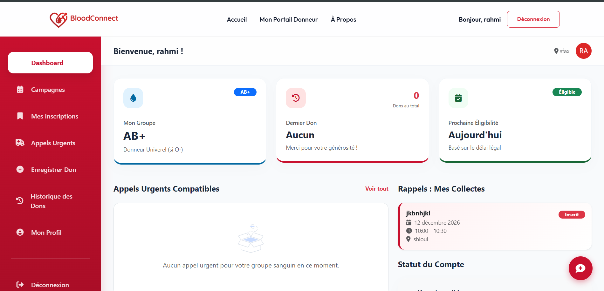
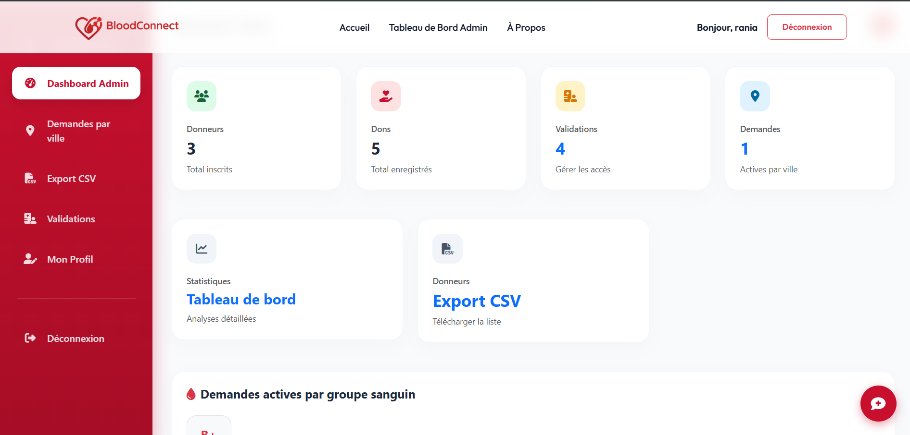
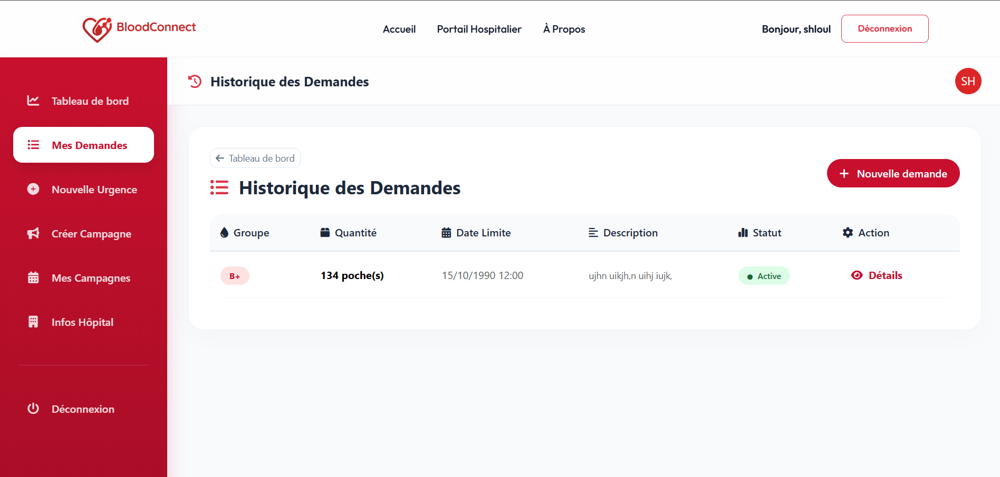
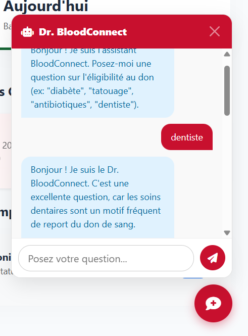

# 🩸 BloodConnect

Bienvenue sur **BloodConnect**, une plateforme moderne et intelligente de gestion des dons de sang développée avec Django. 

La mission de BloodConnect est de faciliter la mise en relation entre les donneurs de sang et les hôpitaux, de gérer les campagnes de collecte, et de répondre efficacement aux demandes urgentes grâce à une interface intuitive et un assistant IA.

---

## 🚀 Fonctionnalités Principales

- **Gestion des Utilisateurs** : Inscription et authentification sécurisées pour deux types de profils : *Donneurs* et *Hôpitaux*.
- **Tableaux de bord (Dashboards)** : Espaces dédiés et personnalisés (Donneur, Hôpital, Administrateur).
- **Demandes Urgentes** : Création et visualisation des besoins urgents en sang par ville et par groupe sanguin.
- **Campagnes de Don** : Organisation des événements de collecte et inscription des donneurs.
- **Dr. BloodConnect (IA)** : Un chatbot médical intelligent propulsé par l'API **Gemini**, capable de répondre en temps réel aux questions d'éligibilité au don.

---

## 📸 Aperçu de l'Application

*(Ajoutez vos captures d'écran dans le dossier `screenshots/` pour qu'elles s'affichent automatiquement ici !)*

### 1. Page d'Accueil
> *Présentation de la plateforme et de sa mission.*


### 2. Tableau de Bord (Donneur)
> *Suivi de l'historique des dons, éligibilité et campagnes à venir.*


### 3. Tableau de Bord (Administration)
> *Vue globale, statistiques sur les groupes sanguins et validation des hôpitaux.*


### 4. Carte des Demandes Urgentes
> *Visualisation des besoins critiques par hôpital et par ville.*


### 5. Chatbot IA (Dr. BloodConnect)
> *Assistant interactif Gemini pour conseiller les utilisateurs.*


---

## 🛠️ Technologies Utilisées

- **Backend** : Python 3.13, Django 5.x
- **Frontend** : HTML5, CSS3 (Glassmorphism design), JavaScript, Bootstrap 5, FontAwesome
- **Base de données** : SQLite (développement)
- **Intelligence Artificielle** : Google Generative AI (Gemini 2.0 Flash / Flash Latest)
- **Déploiement** : Gunicorn, WhiteNoise, hébergement sur PythonAnywhere

---

## 💻 Installation en local

Si vous souhaitez exécuter ce projet sur votre propre machine, suivez ces étapes :

1. **Cloner le dépôt**
   ```bash
   git clone https://github.com/hadhemirahmi/BloodConnect.git
   cd BloodConnect
   ```

2. **Créer et activer un environnement virtuel**
   ```bash
   python -m venv venv
   # Sous Windows :
   venv\Scripts\activate
   # Sous Mac/Linux :
   source venv/bin/activate
   ```

3. **Installer les dépendances**
   ```bash
   pip install -r requirements.txt
   ```

4. **Configurer les variables d'environnement**
   Créez un fichier `.env` à la racine du projet et ajoutez-y :
   ```env
   SECRET_KEY=votre_cle_secrete_django
   DJANGO_DEBUG=True
   DJANGO_ALLOWED_HOSTS=localhost,127.0.0.1
   EMAIL_HOST_USER=votre_email@gmail.com
   EMAIL_HOST_PASSWORD=votre_mot_de_passe_app
   GEMINI_API_KEY=votre_cle_api_gemini
   ```

5. **Appliquer les migrations et lancer le serveur**
   ```bash
   python manage.py migrate
   python manage.py runserver
   ```
   Rendez-vous sur `http://127.0.0.1:8000` !

---

## 🤝 Contribution
Toute contribution est la bienvenue. Pour toute suggestion, n'hésitez pas à ouvrir une *Issue* ou à proposer une *Pull Request*.

**Auteur :** Hadhemi Rahmi
